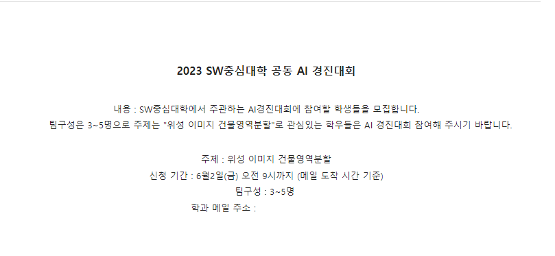
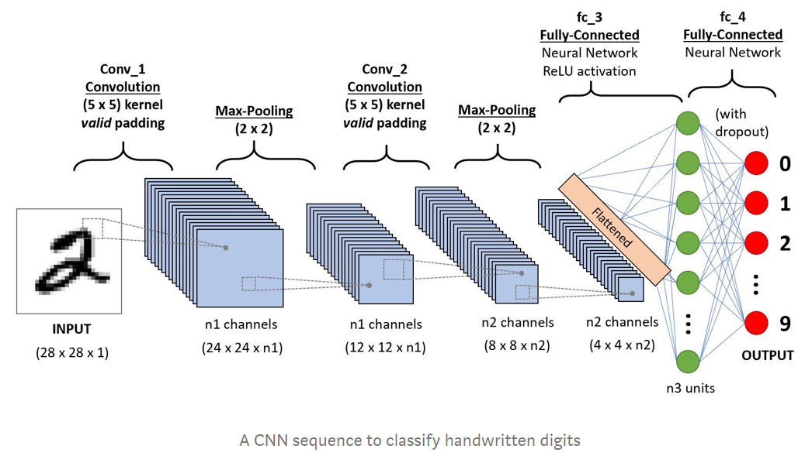
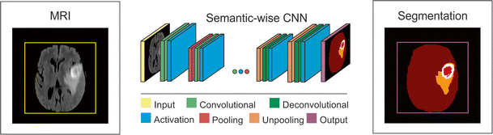
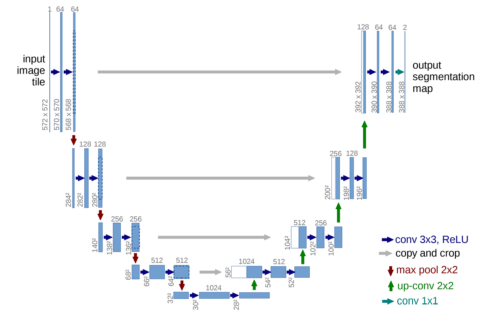

## SW중심대학 공동 AI 경진대회 2023

2023.07.03 ~ 2023.07.28 까지 진행되는 [**SW중심대학 공동 AI 경진대회 2023**](https://dacon.io/competitions/official/236092/overview/description)에 대한 포스트.
>2023 가천대 <b>AL*</b> 팀원들과 연계하여 참가한 공모전

>위성 이미지의 건물 영역 분할(Image Segmentation)을 수행하는 AI모델을 개발

>[GItHub - Repo](https://github.com/sts07142/DACON-Satellite-Image-Building-Area-Segmentation)

## 시작 계기

5월 말 쯤, 학과 공지사항에 "위성 이미지 건물영역분할" AI경진대회 글이 올라온 것을 확인하였다.

AI에 관심이 생기는 시점에 이런 대회 소식을 접하게 되어 무작정 부딪혀 보자고 생각했다.

주변 사람들에게 참여 의사를 물어 5명이서 팀을 구성하게 되었다.

## 목표 & 스터디

딥러닝 경험이 없지만, 대회에 참가하기로 한 이상 상위 25% or 점수 0.75 돌파를 목표로 세웠다.

목표를 이루기 위해서는 관련 개념과 이해가 필요했고, 대회 시작 전 '컴퓨터 비전', '딥러닝', 'AI', 'Image Segmentation' 에 대해 스터디를 진행하였다.

그 중 CNN 구조와 image segmentation, U-Net, VGG-16, EfficientNet, ResNet 모델의 구조와 

전반적인 개념인 Epoch, learning_rate, loss, threshold를 이해하였다.

| | |
|:-:|:-:|
| | | 
||

## 대회 준비

이전에 개최된 [아리랑 위성영상 AI 객체 검출 경진대회](https://dacon.io/competitions/official/235644/overview/description) 를 발견하여, 데이터셋의 구조와 해당 대회의 코드를 학습하였다.

대회와 관련된 오픈소스 코드를 분석해본 결과, 성능 향상을 위한 다양한 접근 방식이 있음을 알게되었다.

- 모델 선택
- 데이터 전처리
- img upsampling
- img crop
- img augmentation
- Segmentation 모델링
- 예측 결과 분석
- 데이터 후처리
- contour 처리

성능 향상에 기여할 다양한 접근 방식이 있음을 확인하고, 위와 같은 순서로 모델 구성 로드맵을 구상하였다.

### 스터디 참고자료
1. https://github.com/museonghwang/aiffel-sia
2. https://github.com/CHEOLLIAN/Satellite-image-object-segmentation
3. https://github.com/GuoLanqing/Awesome-Shadow-Removal
4. https://github.com/satellite-image-deep-learning/techniques#29-segmentation---buildings--rooftops
5. https://github.com/facebookresearch/segment-anything