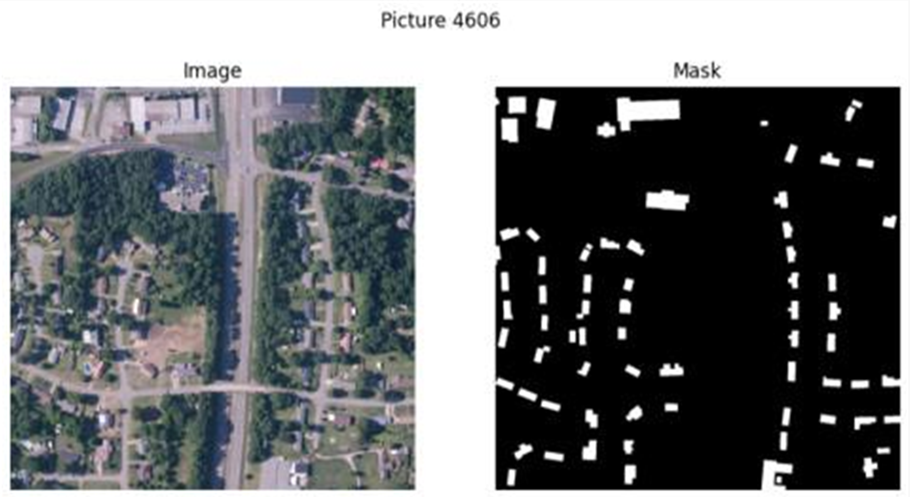
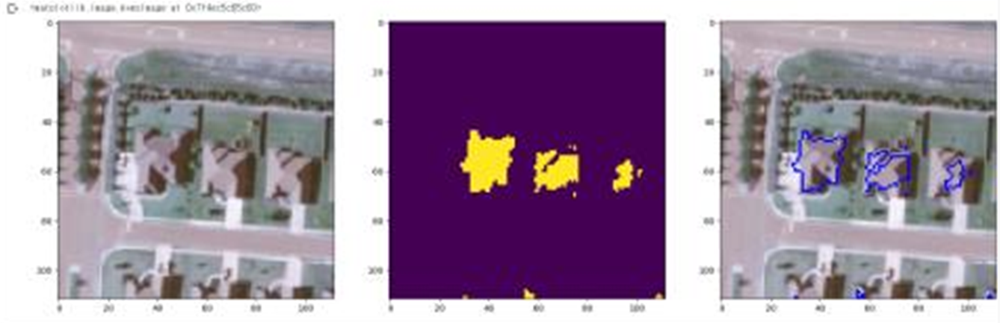
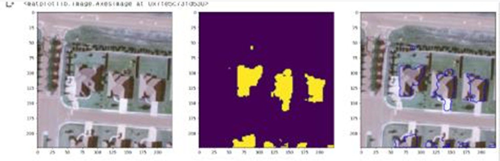

## SW중심대학 공동 AI 경진대회 2023

2023.07.03 ~ 2023.07.28 까지 진행되는 [**SW중심대학 공동 AI 경진대회 2023**](https://dacon.io/competitions/official/236092/overview/description)에 대한 포스트.
>2023 가천대 <b>AL*</b> 팀원들과 연계하여 참가한 공모전

>위성 이미지의 건물 영역 분할(Image Segmentation)을 수행하는 AI모델을 개발

>[GItHub - Repo](https://github.com/sts07142/DACON-Satellite-Image-Building-Area-Segmentation)

# 대회 시작 1주일 경과

대회에서 제공되는  baseline 코드를 기반으로, 다양한 모델을 돌려 성능을 간단히 확인해보았다.

- U-Net ★
- swin transformer
- deeplabv3+ ★
- ViT 
- Exchanger
- Mask2Former
- RepDarkNet
- HRNet ★
- SegNet
- EfficientNet ★
- ResNet ★
- VGG16 ★

위의 모델들 중, EfficientNet, ResNet50, VGG16의 성능이 높게 나오는 것을 확인하였다.

위 3가지 모델을 중심으로 대회를 진행하기로 결정하였다.

## 예측 결과 제출 시작
간단하게 모델을 돌려 1차적으로 점수를 확인하기 위해, 아래와 같은 그림의 결과가 나오는 파일을 제출해보았다.

생각보다 건물 영역 분할이 어느정도 되어있다고 생각했으나, 점수는 0.158 정도로 나왔다.

점수 평가 방식인 Dice Coefficient(Score)의 영향이 큰 것을 확인하였다.

이 중, 이미지에 건물이 없는데 있다고 예측한 경우 점수가 매우 큰 폭으로 하락한다는 점을 파악하였다.

이러한 예측 이미지를 확인해보니, 건물이라고 보기 어려운 크기의 영역을 예측하는 경우가 있음을 확인하였다. 

이를 해결하기 위해 contour를 도입하였다.

## Contour를 이용한 간단한 outlier 처리

Contour를 활용하여 예측한 건물 영역의 크기가 일정 값 이하일 경우, 제거해버리기로 하였다.

이를 적용하여 코드를 제출한 결과, 0.268 의 점수가 나오게 되었다.

아직 매우 낮은 점수이지만, 이전 결과에 비해 2배 정도 기여가 되어 의미가 있음을 파악하였다.

## 이미지 resize

train 이미지 크기가 1024 x 1024 이고, test 이미지 크기가 224 x 224 인 점을 확인하였다.

학습과 테스트 이미지 크기를 똑같이 맞추는 것이 성능 향상에 의미가 있을 것이라 생각하여 resize를 시켜보았다.

train 이미지 크기를 224 x 224로 resize 후, 결과를 확인하였더니 아래 표와 같은 전후 차이가 있었다.

|Default (1024)|Resize (224)|
|:-:|:-:|
|||

결과 파일을 제출하였더니, 0.451 의 점수가 나와 매우 큰폭의 점수 향상을 이뤄내었다.

단순히 이미지 크기를 줄여서 맞춘 것 만으로도 큰 영향이 있음을 확인하였다.

이를 확장하여, train 이미지 크기를 단순히 resize 하는 것이 아니라, 224 x 224로 crop 하여 사용해보기로 하였다.