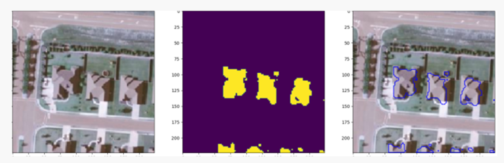
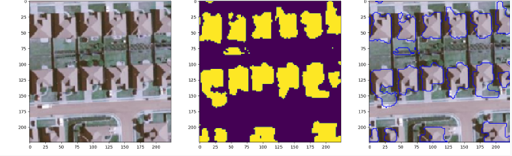

## SW중심대학 공동 AI 경진대회 2023

2023.07.03 ~ 2023.07.28 까지 진행되는 [**SW중심대학 공동 AI 경진대회 2023**](https://dacon.io/competitions/official/236092/overview/description)에 대한 포스트.
>2023 가천대 <b>AL*</b> 팀원들과 연계하여 참가한 공모전

>위성 이미지의 건물 영역 분할(Image Segmentation)을 수행하는 AI모델을 개발

>[GItHub - Repo](https://github.com/sts07142/DACON-Satellite-Image-Building-Area-Segmentation)

<hr>

# 대회 시작 2주일 경과

이전 포스팅에서는 0.451 의 점수로 마무리를 하였고, 이미지 crop을 적용해보기로 하였다.

또한, 예측 이미지를 확인해 본 결과 그림자 부분의 건물 인식이 저조한 것을 확인하였다.

이를 해결하기 위해 shadow 제거와 이미지 augmentation 방식을 선택하였다.


## 이미지 augmentation

아래 표와 같이, 건물 중 그림자 영역의 인식이 안되는 모습을 포착하였다.

|||
|:-:|:-:|
|||

이를 해결하기 위해 간단히 이미지 augmentation을 적용해보기로 하였다.

```python
from albumentations import (
    HorizontalFlip, IAAPerspective, ShiftScaleRotate, CLAHE, RandomRotate90,
    Transpose, ShiftScaleRotate, Blur, OpticalDistortion, GridDistortion, HueSaturationValue,
    IAAAdditiveGaussianNoise, GaussNoise, MotionBlur, MedianBlur, IAAPiecewiseAffine,
    IAASharpen, IAAEmboss, RandomBrightnessContrast, Flip, OneOf, Compose, Normalize, Cutout, CoarseDropout,
    ShiftScaleRotate, CenterCrop, Resize
)
```
위 코드 내 다양한 augmentation 을 적용해보았으나, 그림자 영역 인식에 큰 효과가 없음을 파악하였다.

위 효과들 중 성능 향상에 도움이 되는 augmentation 발견

- HorizontalFlip(p=0.5), # 50% 확률로 이미지를 수평으로 뒤집음
- A.VerticalFlip(p=0.5), # 50% 확률로 이미지를 수직으로 뒤집음
- A.Rotate(limit=30), # -30도에서 30도 사이의 각도로 이미지를 무작위로 회전
- RandomBrightnessContrast(brightness_limit=0.1, contrast_limit=0.1, p=0.5), # 컬러 변형

위의 효과들을 지속적으로 적용하기로 하였다.

## 이미지 crop

1024 x 1024 이미지를 224 x 224 크기로 분할하여, 많은 데이터를 학습하는 시도를 하였다.

crop 이미지를 학습하면 성능이 높아질 것을 기대하였지만, 학습 데이터양이 너무 많아지는 상황이 발생하였다.

> 학습 이미지 개수가 17만 8500장으로 늘어나, 학습 시간이 너무 오래 걸리는 문제 발생

crop된 이미지들 중, 일부를 선택하여 학습하는 방식을 택하여 모델을 돌리게 되었다.

위의 2가지 방식을 적용하여 모델을 시험해본 결과, 0.510 정도의 점수가 나왔다.

## 시도해볼만 한 것들

대회가 절반정도 진행된 가운데, 앞으로 시도해볼만 한 것들을 정리해보았다.
  
  - 전처리 방법 고민
    - 현재 augmentation과 사진 자르기, 해상도 높이기 해봄.
    - 그림자 제거, 에지 강조, 잡음 제거, 대비 향상 등 해보면 좋을 듯
  
  - Unet 모델 개선 
    - 자주 틀리는 데이터를 분석해보고 문제점 파악
    - 하이퍼 파라미터, threshold
  
  - 현재 모델 말고 다른 모델 구축(앙상블 위해서)
    - 백본(현재는 efficientnet)을 다른 걸로 변경
    - 아예 다른 모델 학습
  
  - 모델 앙상블