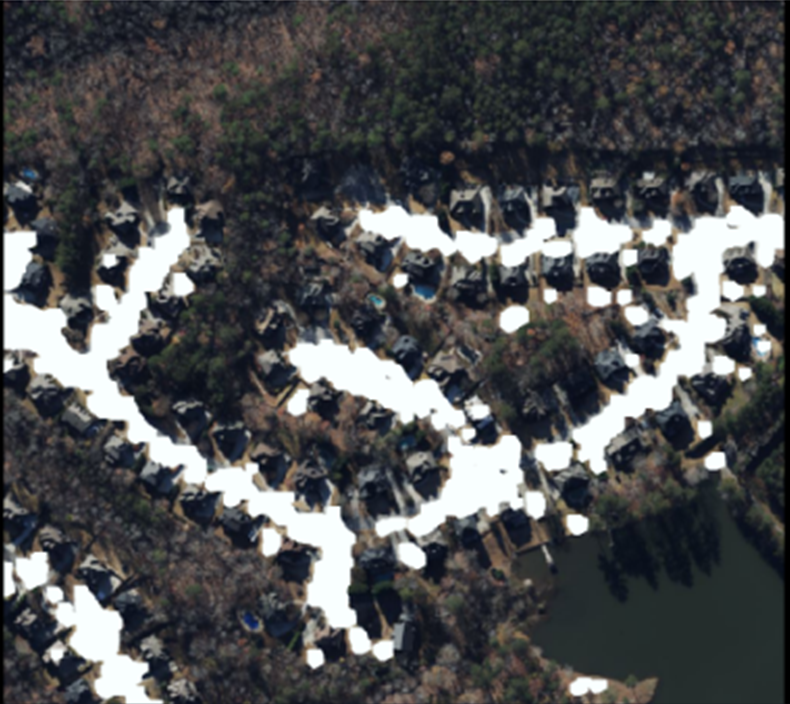

## SW중심대학 공동 AI 경진대회 2023

2023.07.03 ~ 2023.07.28 까지 진행되는 [**SW중심대학 공동 AI 경진대회 2023**](https://dacon.io/competitions/official/236092/overview/description)에 대한 포스트.
>2023 가천대 <b>AL*</b> 팀원들과 연계하여 참가한 공모전

>위성 이미지의 건물 영역 분할(Image Segmentation)을 수행하는 AI모델을 개발

>[GItHub - Repo](https://github.com/sts07142/DACON-Satellite-Image-Building-Area-Segmentation)

# 대회 시작 3주일 경과

이전 포스팅에서는 0.510 의 점수로 마무리를 하였디.

성능 향상을 위해 아래의 과정들을 시도해보기로 하였다.
- 그림자 제거, 에지 강조, 잡음 제거, 대비 향상
- 모델, 백본 변경

## 그림자 제거

그림자 영역을 제거하는 알고리즘을 적용하여 아래 이미지를 얻게되었다.

그렇지만, 이미지에서 알수있듯이 그림자 영역 '자체'를 제거하게 되는 문제가 있었다.

결과적으로 성능향상에 큰 도움이 되지 못하였지만, 그림자 자체만 제거하는 기술을 지속적으로 탐색하였다.

탐색한 여러 그림자 제거 기술의 적용을 시도해보았다.

그러나 그림자 제거 오픈소스가 흔하지 않고, 적용의 어려움 및 오류 발생으로 인해 그림자 제거 계획은 어려울 것으로 보인다.

## 에지강조, 잡음 제거, 대비 향상

albumentations 라이브러리를 이용하여 다양한 시도를 하였으나, 오히려 성능이 감소하는 결과를 초래하였다.

train, test 이미지에 알맞지 않은 효과를 적용하여 성능을 높이는 것은 어려워 보인다.

## 3주차 결과
백본을 ResNet50으로 변경하였더니, 미약한 성능의 향상이 존재하였다.

0.535 의 점수를 얻게되었다.

그림자 제거 기술에 꽤 많은 시간을 들였지만, 오류없이 적용하는 것 자체에 큰 어려움을 겪었다.

오픈소스가 흔하지 않고, 유지보수가 되지 않는 코드가 많았다.

또한, 괜찮은 코드를 발견하여 적용하려 했으나, 지속적인 코드 에러로 인하여 포기하게되었다.

성능 향상을 하기위해 다른 방법을 탐색해봐야 할 것 같다.