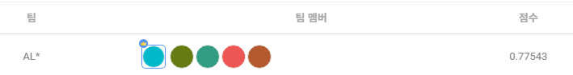

## SW중심대학 공동 AI 경진대회 2023

2023.07.03 ~ 2023.07.28 까지 진행되는 [**SW중심대학 공동 AI 경진대회 2023**](https://dacon.io/competitions/official/236092/overview/description)에 대한 포스트.
>2023 가천대 <b>AL*</b> 팀원들과 연계하여 참가한 공모전

>위성 이미지의 건물 영역 분할(Image Segmentation)을 수행하는 AI모델을 개발

>[GItHub - Repo](https://github.com/sts07142/DACON-Satellite-Image-Building-Area-Segmentation)

<hr>

# 대회 시작 4주일 경과 / 대회 종료

이전 포스팅에서는 0.535 의 점수로 마무리를 하였디.

성능 향상을 위해 많은 투자를 한 '그림자 제거' 에서 성과를 거두지 못하였다.

이전 포스팅으로부터 1주일간 성능 향상을 위해 많은 노력을 하였다.

## 모델 구조 개선

기존의 단순하게 코드를 건드리는 방식으로는 성능 향상이 어렵다고 판단하였다.

근본적인 성능 향상을 위해 U-Net의 코드를 개선하였다.

Double Convolution Block 부분을 변경하고, conv 과정을 추가하였다.

- Before
```python
def double_conv(in_channels, out_channels):
    return nn.Sequential(
        nn.Conv2d(in_channels, out_channels, 3, padding=1),
        nn.ReLU(inplace=True),
        nn.Conv2d(out_channels, out_channels, 3, padding=1),
        nn.ReLU(inplace=True)

class UNet(nn.Module):
    def __init__(self, backbone_name=BACKBONE, classes=1, encoder_weights='imagenet'):
        super(UNet, self).__init__()

        self.backbone = BACKBONE

        self.dconv_down1 = double_conv(3, 64)
        self.dconv_down2 = double_conv(64, 128)
        self.dconv_down3 = double_conv(128, 256)
        self.dconv_down4 = double_conv(256, 512)

        self.maxpool = nn.MaxPool2d(2)
        self.upsample = nn.Upsample(scale_factor=2, mode='bilinear', align_corners=True)

        self.dconv_up3 = double_conv(256 + 512, 256)
        self.dconv_up2 = double_conv(128 + 256, 128)
        self.dconv_up1 = double_conv(128 + 64, 64)

        self.conv_last = nn.Conv2d(64, classes, 1)
```
- After
```python
def CBR2d(in_channels, out_channels,kernel_size=3, stride=1, padding=1, bias=True):
        layers = []
        layers += [nn.Conv2d(in_channels=in_channels, out_channels=out_channels,kernel_size=kernel_size, stride=stride, padding=padding,bias=bias)]
        layers += [nn.BatchNorm2d(num_features=out_channels)]
        layers += [nn.ReLU()]

        cbr = nn.Sequential(*layers)

        return cbr

    
class UNet(nn.Module):
    def __init__(self, backbone_name=BACKBONE, classes=1, encoder_weights='imagenet'):
        super(UNet, self).__init__()

        self.backbone = BACKBONE

        self.enc1_1 = CBR2d(in_channels=3, out_channels=64)
        self.enc1_2 = CBR2d(in_channels=64, out_channels=64)

        self.pool1 = nn.MaxPool2d(kernel_size=2)

        self.enc2_1 = CBR2d(in_channels=64, out_channels=128)
        self.enc2_2 = CBR2d(in_channels=128, out_channels=128)

        self.pool2 = nn.MaxPool2d(kernel_size=2)

        self.enc3_1 = CBR2d(in_channels=128, out_channels=256)
        self.enc3_2 = CBR2d(in_channels=256, out_channels=256)

        self.pool3 = nn.MaxPool2d(kernel_size=2)

        self.enc4_1 = CBR2d(in_channels=256, out_channels=512)
        self.enc4_2 = CBR2d(in_channels=512, out_channels=512)

        self.pool4 = nn.MaxPool2d(kernel_size=2)

        self.enc5_1 = CBR2d(in_channels=512, out_channels=1024)

        # 확장 경로(Expansive path)
        self.dec5_1 = CBR2d(in_channels=1024, out_channels=512)

        self.unpool4 = nn.ConvTranspose2d(in_channels=512, out_channels=512,
                                          kernel_size=2, stride=2, padding=0, bias=True)

        self.dec4_2 = CBR2d(in_channels=2 * 512, out_channels=512)
        self.dec4_1 = CBR2d(in_channels=512, out_channels=256)

        self.unpool3 = nn.ConvTranspose2d(in_channels=256, out_channels=256,
                                          kernel_size=2, stride=2, padding=0, bias=True)

        self.dec3_2 = CBR2d(in_channels=2 * 256, out_channels=256)
        self.dec3_1 = CBR2d(in_channels=256, out_channels=128)

        self.unpool2 = nn.ConvTranspose2d(in_channels=128, out_channels=128,
                                          kernel_size=2, stride=2, padding=0, bias=True)

        self.dec2_2 = CBR2d(in_channels=2 * 128, out_channels=128)
        self.dec2_1 = CBR2d(in_channels=128, out_channels=64)

        self.unpool1 = nn.ConvTranspose2d(in_channels=64, out_channels=64,
                                          kernel_size=2, stride=2, padding=0, bias=True)

        self.dec1_2 = CBR2d(in_channels=2 * 64, out_channels=64)
        self.dec1_1 = CBR2d(in_channels=64, out_channels=64)

        self.fc = nn.Conv2d(in_channels=64, out_channels=1, kernel_size=1, stride=1, padding=0, bias=True)
```

위와 같은 모델 구조를 변경하고 모델을 돌린 결과 0.660 의 점수를 얻게되었다.

## 학습량 증가

이전 포스팅에서 1024 x 1024 이미지를 224 x 224 크기로 crop하여 학습하기로 하였다.

이때 생기는 학습 이미지가 너무 많아서 일부만 사용하였는데, 이 양을 증가시키기로 하였다.

사실 이때 기준으로 대회 종료가 코앞이라 추가적으로 손 댈곳을 찾지 못하였다.

이미지 학습량을 기존보다 4배 정도를 사용하였다.

결과적으로 0.775 의 점수를 얻으며 상위 25%로 대회를 마무리하였다.

### 최종 PUBLIC 점수

