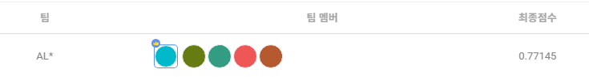

## SW중심대학 공동 AI 경진대회 2023

2023.07.03 ~ 2023.07.28 까지 진행되는 [**SW중심대학 공동 AI 경진대회 2023**](https://dacon.io/competitions/official/236092/overview/description)에 대한 포스트.
>2023 가천대 <b>AL*</b> 팀원들과 연계하여 참가한 공모전

>위성 이미지의 건물 영역 분할(Image Segmentation)을 수행하는 AI모델을 개발

>[GItHub - Repo](https://github.com/sts07142/DACON-Satellite-Image-Building-Area-Segmentation)

# 대회 후기

사실 대회가 처음이기도 하고, 딥러닝도 처음인 상황이었다.

딥러닝이라는 개념도 잘 모르던 상태에서, 1달동안 많은 성장을 했다고 느낀다.

대회 시작할 때 목표였던 0.75를 돌파하고 상위 25%로, 대회 전 작은 목표를 이뤘다.

대회에 참여하며 다양한 것을 깨닫게 되었다.

- 데이터 전처리/후처리 의 중요성
- 예측 결과에서 문제점 파악
- 문제점 해결 방안
- GPU 자원
- 하이퍼파라미터 튜닝

위와 같은 것을 몸소 체감하였다.

# 아쉬운 점

### 1. 모델 적용
대회를 진행하며 팀원이 발견하고 적용 중이던 facebookresearch/segment-anything 모델이 있었다.

모델을 분석하고 해당 대회에 적용하는 과정 중, 시간이 부족하여 끝내 적용하지 못한 모델이다.

임시로 확인해본 결과에서 매우 높은 성능을 보였지만 최종적으로 적용하지 못해 아쉽게 느껴진다.

### 2. 하이퍼파리미터 튜닝
성능을 높이기 위한 다양한 과정이 있었지만, 하이퍼파리미터 튜닝을 진행하지 못하였다.

딥러닝 시도가 처음이라 파라미터 튜닝을 시도해보지 못하였고, 관련된 지식이 부족하다고 생각한다.

파라미터 튜닝을 하였다면, 더 높은 성적을 얻을 수 있을 것이라 생각된다.

하이퍼파라미터 튜닝을 위한 방법을 탐색하여 공부하야겠다고 느낀다.

# 마무리
해당 대회를 진행하며, 문제 해결을 위한 다양한 접근 방식을 알게되었다.

딥러닝과 관련하여 내게 부족한 점들을 한눈에 알 수 있는 좋은 기회였다.

또한, 데이터 전처리/후처리 와 예측 결과에서의 문제점 해결하는 부분이 흥미롭게 느껴졌다.

결과적으로 딥러닝과 데이터에 관심을 갖게 되었고, 좋은 경험이었다.

앞으로 다양한 대회에 도전하는 좋은 계기가 될 것 같다.

### 최종 PRIVATE 점수

